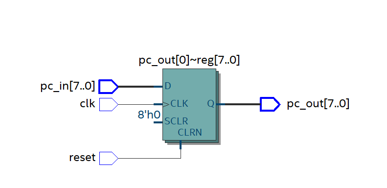
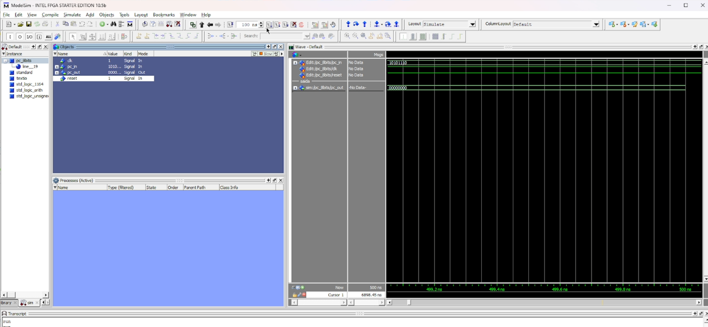

# Relatório Técnico do Contador de Programa (PC)

## Componente: Program Counter (PC)

### 1. Descrição do Componente

- **Descrição Geral:**  
  O Contador de Programa (**PC - Program Counter**) é um registrador especial em um processador que armazena o endereço da próxima instrução a ser executada. Ele é responsável pelo fluxo sequencial da execução das instruções e pode ser atualizado por sinais de controle.

### Componentes do Contador de Programa:

- **Entradas e Saídas do PC**

  | Sinal     | Função |
  |-----------|------------------------------------------------|
  | **pc_in**  | Entrada de 8 bits que define o novo endereço do PC |
  | **clk**   | Clock utilizado para atualizar o registrador |
  | **reset** | Sinal de reinicialização do PC para um valor padrão |
  | **pc_out** | Saída de 8 bits com o endereço armazenado |

### 2. Esquema do Circuito

- **Diagrama do Circuito:**
  
  
  
  *Legenda:* O circuito do PC é composto por um registrador de 8 bits que recebe os dados de entrada (**pc_in**) e armazena o endereço até ser atualizado pelo sinal de clock (**clk**) ou redefinido pelo sinal de reset (**reset**).

### 3. Funcionamento Geral

1. **Entrada de Dados:**  
   - O PC recebe um valor de 8 bits pela entrada **pc_in**.
   
2. **Atualização do Valor:**  
   - A cada ciclo de clock (**clk**), o valor armazenado pode ser atualizado com um novo endereço.
   
3. **Reinicialização:**  
   - Quando o sinal **reset** é ativado, o PC volta para um valor padrão (por exemplo, 0x00).

### 4. Testes Realizados

#### Configuração do Teste

- **Objetivo:** Verificar se o PC armazena corretamente o endereço fornecido e se responde corretamente aos sinais de clock e reset.

- **Entradas e Saídas Esperadas:**

  | Entrada  | Estado Inicial | Sinal Aplicado | Estado Final Esperado |
  |----------|---------------|----------------|------------------------|
  | pc_in = 10101110 | pc_out = 00000000 | clk ativado | pc_out = 10101110 |
  | reset desativado | pc_out = 10101110 | reset desativado | pc_out = 10101110  |

#### Resultados Obtidos

- **Tabela de Resultados:**
  
  | Entrada  | Sinal Aplicado | Saída Obtida |
  |----------|---------------|--------------|
  | pc_in = 10101110 | clk ativado | pc_out = 00000000 |
  | reset ativado | reset ativado | pc_out = 00000000 |
  
- **Captura de Tela do Teste:**
  
  
  
  *Legenda:* O PC atualizou corretamente os valores e respondeu ao reset como esperado.

### 5. Conclusão

Os testes realizados confirmaram que o Contador de Programa (**PC**) funciona corretamente, armazenando e atualizando o endereço com base nos sinais de controle. Ele responde ao **clk** para atualizar o valor e ao **reset** para retornar ao estado inicial.

---

